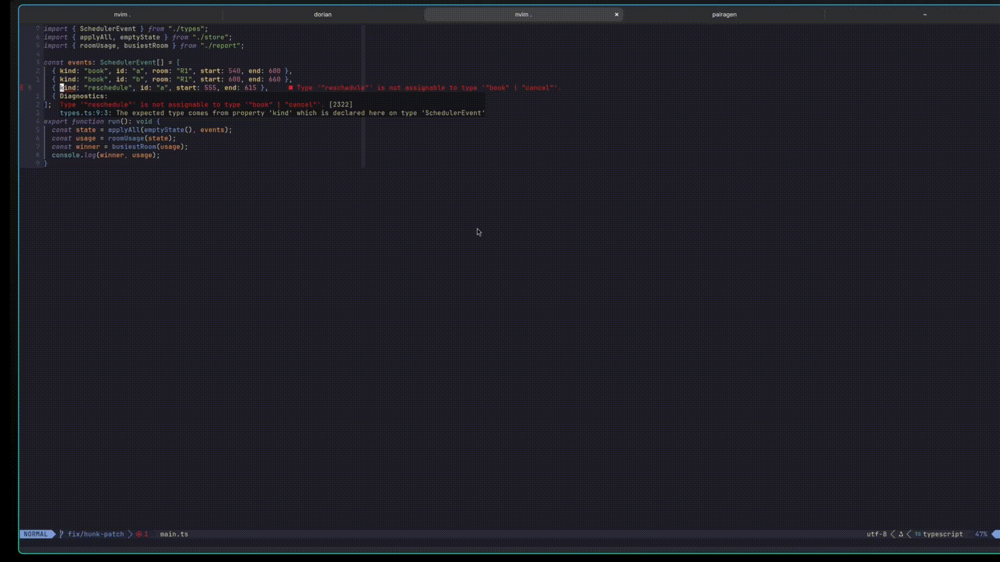

<p align="center">
  
</p>
<p align="center"><strong>WHERE HUMAN IS IN THE LOOP</strong></p>

Repo ready for desloppification. I had fun with vibing this project,
but because of growing size and complexity it's time take the steer.

# Loopbiotic



Loopbiotic is an interactive pair-programming stepper for Neovim.

It is not a chat.
It is not autocomplete.
It shows one strong hypothesis, finding, or patch at a time.
You follow, inspect, fix, apply, or stop.
Backends are replaceable.
The editor experience stays the same.

## Status and compatibility

Loopbiotic is beta software. It has been developed and tested primarily with the
Codex CLI app-server backend. Persistent Claude CLI (stream-json), Ollama HTTP,
generic CLI, and stdio agent adapters are available, but currently receive less
real-world testing than Codex.

Requirements:

- Neovim 0.10 or newer,
- `curl`, `tar`, and either `sha256sum` or `shasum` for managed installation,
- Codex CLI for the tested Codex backend,
- Linux x86_64/aarch64 or macOS Intel/Apple Silicon for managed `loopbioticd` binaries.

Implemented capabilities include:

- Neovim labeled textarea prompt, card, navigation, annotation, diff, apply and reject UI
- thinking spinner, resume and reset controls
- raw, cached, and non-cached session token usage plus a local error log
- JSON-RPC over stdio
- Rust session harness
- continuous goal state machine with local hunk-by-hunk review
- patch gate
- mock backend
- generic CLI backend
- persistent Claude CLI backend (one stream-json process per session)
- Ollama HTTP backend for local models (model stays loaded, JSON-forced output)
- structured agent denial (`deny` op) rendered as a distinct card
- deterministic token-budgeted project context with LSP hints and dependency ranking

## Installation

With lazy.nvim:

```lua
{
  "DorianDevp/loopbiotic",
  config = function()
    require("loopbiotic").setup({
      backend = {
        agent = "codex",
      },
    })
  end,
}
```

On the first Loopbiotic request, the plugin downloads the matching versioned `loopbioticd`
archive from GitHub Releases, verifies its SHA-256 checksum, and installs it
under `stdpath("data")/loopbiotic/bin`. No global installation is required.

Run `:checkhealth loopbiotic` after installation.

### Manual backend

Automatic installation can be disabled or replaced with a custom binary:

```lua
require("loopbiotic").setup({
  backend = {
    command = "/absolute/path/to/loopbioticd",
    args = { "--stdio" },
    agent = "codex",
    mode = "auto",
  },
  distribution = {
    auto_install = false,
  },
})
```

For local development:

```lua
require("loopbiotic").setup({
  backend = {
    command = "cargo",
    args = { "run", "-p", "loopbioticd", "--", "--stdio" },
    agent = "mock",
    mode = "auto",
  },
})
```

When using a built `target/debug/loopbioticd`, run `cargo build -p loopbioticd` after protocol
changes. `cargo test` only refreshes test executables under
`target/debug/deps`. The client rejects stale `loopbioticd` protocol versions before
starting a session.

## Agents

```lua
require("loopbiotic").setup({
  backend = {
    agent = "codex",
  },
  agents = {
    codex = {
      kind = "codex_app",
      command = "codex",
      args = {
        "app-server",
        "--stdio",
      },
    },
    agent = {
      kind = "agent",
      command = "loopbioticd",
      args = { "dev", "stdio-agent" },
    },
    claude = {
      kind = "generic",
      command = "claude",
      args = {},
    },
    ["local"] = {
      kind = "generic",
      command = "ollama",
      args = { "run", "qwen2.5-coder:7b" },
    },
  },
})
```

Switch at runtime:

```vim
:LoopbioticAgent codex
:LoopbioticAgent agent
:LoopbioticAgent claude
:LoopbioticAgent local
:LoopbioticModel <model>
```

If the active agent has no `model` set in `setup()`, `:LoopbioticModel <model>` stores
the selection per agent in `stdpath("state")/loopbiotic/preferences.json` and
restores it on the next Neovim start. A model explicitly configured in
`setup()` always takes precedence. `:LoopbioticModel default` clears the stored model
and returns that agent to its own default.

The prompt window title always names the active agent and the concrete model
the next turn will use, e.g. `codex / gpt-5.4-mini`. Without a configured
model it shows the model the backend announces during warmup (or reported
after the last turn), and `model?` until one is known — it never shows
`default`. The title always names the patch-drafting model; when an agent
runs discovery on a different model (the shipped claude agent pins
`discovery_model = "haiku"`), that is shown separately, e.g.
`claude-fable-5 · discovery haiku`. Press `<C-l>` (`keymaps.models`) inside
the prompt to pick a model from every known candidate: the configured model,
the models the backend enumerates (Ollama's local tags; claude offers its
stable CLI aliases `sonnet`, `opus`, `haiku`), an optional `models` list on
the agent definition, and the model reported by the last turn. Picking sets
the patch model; `discovery_model` stays as configured. The picked model
persists per agent exactly like `:LoopbioticModel`; the prompt window and its
typed text stay open.

```lua
require("loopbiotic").setup({
  agents = {
    ["local"] = {
      kind = "ollama",
      host = "http://127.0.0.1:11434",
      models = { "qwen2.5-coder:7b", "llama3.1:8b" }, -- extra picker candidates
    },
  },
  keymaps = {
    models = "<C-l>", -- model picker inside the prompt window
  },
})
```

## Flow

```text
<leader>a
Prompt
Persistent agent goal
Agent inspects the project and prepares the complete multi-file change
One local editable hunk
Edit the inline draft
Accept, Reject, edit, message, or ask Why
Why → explanation → Back to the same pending draft
Accept → advance to the next queued hunk without calling the agent
Reject → agent automatically reworks the hunk
Next file opens automatically inside the workspace without calling the agent
Next editable hunk
Repeat until completed-goal summary and local diagnostics check
```

Cards stay anchored clear of the source line and do not take focus. Use `<leader>pg`
to jump to a finding or return to the active proposal, and `<leader>pr` to reveal or
focus the current Loopbiotic card. Draft retry uses `<leader>pt`; actions
are disabled while their card is hidden or no longer offers them. Long goals
and draft explanations stay compact by default; press `z` while the card is
focused to expand or collapse their full text (`keymaps.details` changes this
key).

For a goal patch, Loopbiotic validates every returned file against its live editor
buffer, queues the complete batch, and opens each location only when its hunk is
ready for review. Navigation and acceptance are local operations and do not
start another model turn. Automatic navigation is restricted to the current
workspace; edits are still inert drafts until the user accepts each hunk. If
the agent could not inspect a required file, `open_location` remains a fallback
that supplies its buffer in a subsequent turn.

Loopbiotic moves directly to the evidence for a location-bearing card and to the
first non-blank character of the first added line for a draft, including drafts
in the current file. It stays at that destination while the action card follows
the active tab; it does not bounce through an older window that happens to show
the same buffer.

By default the first card is whatever fits the prompt best: a hypothesis, a
finding, or a clarifying choice when the prompt is ambiguous. Start the prompt
with `/{kind}` to demand a specific card instead — `/hypothesis`, `/finding`,
`/patch` (alias `/fix`), `/choice`, or `/summary`. For example
`/patch guard the payload here` skips discovery and drafts a patch directly.
Unknown words after `/` are treated as normal prompt text, so paths like
`/tmp/project` are safe.

The goal and accepted-step count stay visible on cards and editable drafts. In
the default `auto` mode the agent owns the complete process: it inspects the
project and prepares the complete change across the required files in one turn.
Loopbiotic then presents that batch hunk by hunk; `Accept` advances locally without
another model call, and accepting the final complete hunk closes the goal
locally. `Reject`, `Retry`, a file the agent could not inspect, or an explicit
question can return control to the agent. User control is the hunk gate, not a
repeated discovery/assess/draft ceremony. Asking `Why`
opens a side conversation about the pending hunk and then returns to that exact
draft without advancing or replacing it. Explicit
`/{kind}` prompts and investigate/explain/review modes remain available for
one-card workflows.

When the goal completes, Loopbiotic automatically checks error-level diagnostics in
the changed, loaded buffers after a short delay. `Check` repeats the same local
operation without spending model tokens, saving buffers, or running shell test
commands.

Speculative patch prefetch is off by default because an unused draft still costs
a full model turn. Set `backend.prefetch = "fix"` only when that latency/cost
tradeoff is intentional.

Cards show raw, cached, and non-cached turn and session usage against
`backend.token_budget` (50,000 raw tokens by default).
After the budget is reached, Loopbiotic asks before every additional agent turn; local
navigation, patch review/apply, and stopping remain immediate. Set the budget to
`0` to disable this guard.

## Context optimization

Loopbiotic builds a small ranked context bundle before calling an agent. Live editor
buffers remain the source of truth when validating editable patches. Extra
project fragments are selected deterministically from:

- definitions, declarations, type definitions and implementations reported by
  active Neovim LSP clients,
- diagnostics published through `vim.diagnostic`, including diagnostics exposed
  by tools such as rust-analyzer and clippy,
- direct and two-hop import/module dependencies,
- symbol definitions and references matching the prompt, selection and cursor,
- prompt-driven workspace symbols from the user's attached language servers,
- related tests.

Generated directories, VCS metadata, dependency vendors and large or binary
files are excluded. Source-like templates and assets (including HTML, CSS,
Askama/Jinja/Handlebars/Tera/Twig templates, Astro and GraphQL) are indexed too.
An exact prompt path or basename receives the strongest deterministic signal;
rare compound identifiers such as `preview_html` are favored while terms found
throughout the repository are down-ranked. Candidates below
`min_artifact_score` are omitted. The project index is incremental, cached in the `loopbioticd`
process and invalidated after an applied Loopbiotic patch. Ranked fragments are packed
into a hard token budget; candidates which do not fit are omitted.

Cursor LSP queries and prompt-driven `workspace/symbol` queries share small,
configurable deadlines. Results outside the project root are discarded and
duplicate locations from multiple language servers or methods are merged. This
lets existing clients such as typescript-language-server, Angular LS, gopls,
Intelephense and rust-analyzer act as a cheap semantic index. Diagnostics from
clippy remain available through `vim.diagnostic`.

Codex app-server threads also fingerprint their supplied context. An unchanged
buffer and unchanged ranked fragments are referenced from the preceding turn
instead of being sent again. Stateless generic and stdio backends continue to
receive a complete compact bundle. Contract retries reuse the current Codex
thread. Reviewing queued hunks is entirely local, so it does not extend the
agent conversation or resend the goal context.

The defaults can be overridden during setup:

```lua
require("loopbiotic").setup({
  prompt = {
    -- Prompt and reply windows stay above Loopbiotic cards.
    zindex = 200,
  },
  context = {
    before = 24,
    after = 24,
    optimization = {
      enabled = true,
      total_token_budget = 2400,
      reserved_tokens = 700,
      primary_token_budget = 1000,
      max_artifacts = 4,
      snippet_lines = 10,
      max_scan_files = 2000,
      max_file_bytes = 524288,
      cache_ttl_ms = 1500,
      min_artifact_score = 40,
      exclude = { "generated", "fixtures/large" },
    },
    lsp = {
      enabled = true,
      -- This is one total deadline shared by every active client and method.
      timeout_ms = 120,
      max_locations = 16,
      workspace_timeout_ms = 120,
      max_workspace_queries = 3,
      definition = true,
      declaration = true,
      type_definition = true,
      implementation = true,
      -- References can be expensive and numerous, so they are opt-in.
      references = false,
      workspace_symbols = true,
    },
  },
})
```

Each card shows the used context budget and selected fragment count. The JSONL
trace contains a `context_optimization` event with cache statistics, ranked
candidates, scores and selection decisions. It does not add those statistics to
the agent prompt.

Choosing `Fix` on a card first moves the source context to the card's
`next_move` (falling back to evidence/location), then captures the next request.
The patch agent therefore receives the recommended consumer or template instead
of the file where discovery happened.

The future optional classical-ML ranking design is documented in [`doc/ml.md`](doc/ml.md).
The current implementation does not train or run an ML model.

## Commands

```vim
:Loopbiotic
:LoopbioticReply
:LoopbioticFix
:LoopbioticWhy
:LoopbioticFollow
:LoopbioticOther
:LoopbioticAssess
:LoopbioticNext
:LoopbioticStop
:LoopbioticHide
:LoopbioticResume
:LoopbioticReset
:LoopbioticLog
:LoopbioticLogClear
:LoopbioticBackend
:LoopbioticAgent
:LoopbioticModel
```

`:LoopbioticLog` prints the current JSONL session trace. It records the backend command
and protocol handshake, structured RPC requests/responses, progress events,
cards, goals, token usage, and backend errors. Every completed backend turn also
emits an `agent_attempts` event. Each attempt records its
accepted/retry/rejected outcome, retry metadata, per-attempt token usage and
compact tool activity. Content-bearing fields are represented by redaction
metadata unless full-content logging is explicitly enabled.

The default trace location is:

```text
~/.local/state/nvim/loopbiotic/sessions/<timestamp>-<pid>.jsonl
```

Logs redact prompts, source excerpts, diffs, findings, and model content by
default. At most 20 trace files are retained. Logging can be disabled or full
content can be enabled explicitly:

```lua
require("loopbiotic").setup({
  logging = {
    enabled = true,
    include_content = false,
    max_files = 20,
  },
})
```

Full-content logs may contain proprietary code and should never be attached to
public issues without review.

## Troubleshooting

Run:

```vim
:checkhealth loopbiotic
```

It reports the plugin and protocol versions, release target, managed `loopbioticd`
state, downloader prerequisites, active agent/model, logging privacy, and LSP
clients. A protocol mismatch means the Lua plugin and `loopbioticd` come from
different releases; remove the managed version directory or update the plugin.

## License

Loopbiotic is available under the [MIT License](LICENSE).

## loopbioticd

```bash
loopbioticd --stdio
loopbioticd backend list
loopbioticd backend check
loopbioticd schema card
loopbioticd dev mock-session
```

## Generic Backend

```bash
LOOPBIOTIC_BACKEND=generic \
LOOPBIOTIC_GENERIC_COMMAND=codex \
loopbioticd --stdio
```

`LOOPBIOTIC_GENERIC_ARGS` is split on whitespace.

The generic backend sends a strict JSON card contract to stdin. It accepts a raw final JSON card for backwards compatibility, or an NDJSON stream:

```json
{"t":"loopbiotic_progress","phase":"reviewing","message":"Reviewing the supplied context"}
{"t":"loopbiotic_result","result":{"op":"hypothesis","title":"...","claim":"..."}}
```

`loopbiotic_progress.message` is user-visible feedback. It must be a concise status summary, never raw model reasoning. Claude and local agents that do not emit this protocol still show lifecycle feedback from Loopbiotic while their process is running.
